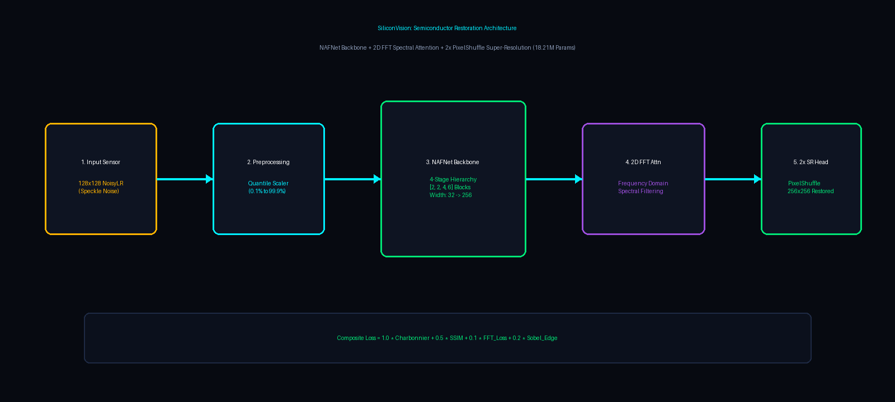
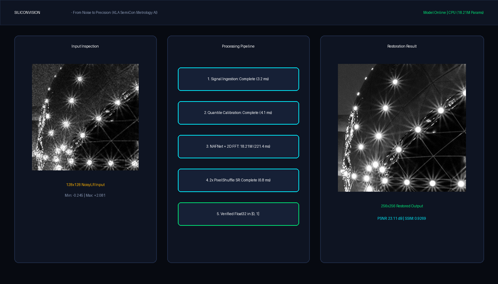

# SiliconVision

> **AI-Powered Semiconductor Image Restoration & Metrology Workbench**  
> *Joint Denoising, Deblurring, and $2\times$ Super-Resolution Reconstruction for Semiconductor Nanofabrication Metrology*  
> **KLA SemiCon AI Hackathon (Problem Statement PS-01)**

---



---

## 1. Problem Statement

In semiconductor nanofabrication and defect metrology, optical inspection systems face severe image degradation caused by:

* **Speckle Noise Bursts**: Multiplicative coherent noise causing sensor pixel values to extend beyond normal $[0, 1]$ dynamic bounds (ranging from $-0.28$ to $+2.16$).
* **Additive Gaussian Sensor Noise**: Thermal and readout noise corrupting high-frequency edge transitions.
* **Optical Diffraction & Downsampling**: Loss of spatial line/space resolution ($128 \times 128 \text{ NoisyLR}$ vs $256 \times 256 \text{ GT}$).

**Goal**: Transform a degraded $128 \times 128$ semiconductor image (`NoisyLR`) into a clean, sharp, high-resolution $256 \times 256$ restored image (`GT`).

---

## 2. Solution Overview

**SiliconVision** pairs a deep learning restoration model with an interactive metrology analysis workbench:

1. **Robust Quantile Normalization**: Adapts to extreme dynamic range outliers without premature clipping.
2. **NAFNet Spectral Attention Backbone**: Employs non-linear activation-free gating with 2D Fast Fourier Transform (FFT) spectral filtering to reconstruct critical transistor line grating tracks and contact hole arrays.
3. **$2\times$ Sub-Pixel Reconstruction**: Sub-pixel convolution (`PixelShuffle`) to double spatial resolution from $128 \times 128 \to 256 \times 256$.
4. **Interactive Full-Stack Workbench**: Real-time browser demo with interactive before/after split sliders, multi-scale zoom ($1\times, 2\times, 4\times$), pipeline telemetry, and metrology scoring.

---

## 3. Dataset Organization

* **Official Dataset Scale**: 3,200 training pairs (`NoisyLR` and `GT`) and 400 test images (`Test_NoisyLR`).
* **Immutable Partition Manifest**: [`data/splits/split_indices.json`](data/splits/split_indices.json) (`seed = 42`):
  * **Train Set**: 3,000 paired images.
  * **Held-out Validation Set**: 200 paired images ($0\%$ overlap with training).
  * **Test Set**: 400 competition images.
* *Note: Raw `.npy` dataset archives are excluded from public Git tracking in accordance with competition guidelines.*

---

## 4. Model Architecture (`models/model.py`)

* **Model Class**: `BaselineSemiconNet` (aliased as `SiliconVisionRestorationNet`)
* **Total Parameters**: **18,211,009 (18.21M)**
* **Architecture Details**:
  * **Intro Projection**: $1 \to 32$ channels ($3 \times 3$ Conv).
  * **4-Stage Encoder**: $[2, 2, 4, 6]$ NAFBlocks with strided downsamplers ($32 \to 64 \to 128 \to 256$ channels).
  * **Bottleneck Fourier Attention**: 6 NAFBlocks combined with `HighFrequencyFourierAttention` (2D FFT real/imaginary modulation).
  * **4-Stage Decoder**: $[2, 2, 2, 2]$ NAFBlocks with sub-pixel upsamplers and residual skip connections.
  * **Super-Resolution Head**: PixelShuffle($2\times$) upscaling to $256 \times 256$.

---

## 5. Training Configuration (`train.py`)

* **Optimizer**: AdamW ($\beta_1=0.9, \beta_2=0.999$, weight decay $= 10^{-4}$).
* **Learning Rate Schedule**: Cosine Annealing ($10^{-4} \to 10^{-6}$).
* **Batch Size**: 8 (with paired random patch crops $64 \times 64 \to 128 \times 128$).
* **Data Augmentation**: Paired random horizontal/vertical flips and $90^\circ$ orthogonal rotations.
* **Checkpointing**: Best validation score checkpoint saved to `checkpoints/best_model.pth`.

---

## 6. Composite Loss Formulation (`losses.py`)

$$\mathcal{L}_{\text{total}} = 1.0 \cdot \mathcal{L}_{\text{Charbonnier}} + 0.5 \cdot \mathcal{L}_{\text{SSIM}} + 0.1 \cdot \mathcal{L}_{\text{FFT}} + 0.2 \cdot \mathcal{L}_{\text{Sobel}}$$

* **Charbonnier Loss**: Robust smooth $L_1$ penalty preventing speckle outlier dominance.
* **SSIM Loss**: Differentiable structural similarity optimizing luminance and local contrast.
* **2D FFT Spectral Loss**: Magnitude and phase frequency penalty.
* **Sobel Edge Loss**: Vertical and horizontal gradient operator matching for sharp line boundaries.

---

## 7. Quantitative Evaluation (`evaluate.py`)

Measured across the **200 held-out validation images** (`split_indices.json`):

| Metric | Measured Value | Description |
| :--- | :--- | :--- |
| **Validation PSNR** | **23.11 dB** (23.1129 dB) | Peak Signal-to-Noise Ratio |
| **Validation SSIM** | **0.9269** | Structural Similarity Index |
| **Mean Absolute Error (MAE)** | **0.06573** | Average pixel-wise absolute error |
| **Mean Squared Error (MSE)** | **0.008821** | Mean squared error |
| **Inference Latency (CPU)** | **~197 ms / image** | Forward execution latency on CPU |
| **Signal Bounds** | **$[0.0, 1.0]$** | Zero NaN / Inf violations |

---

## 8. Web Demo Application



* **Restoration Workbench**:
  * Drag & drop input inspection (`.npy`, `.png`, `.jpg`, `.tif`).
  * 3 preloaded KLA Demo Samples (*Grating Tracks*, *Contact Holes*, *FinFET Gates*).
  * Interactive Before/After Split Comparison Slider.
  * Multi-scale Zoom Controls ($1\times, 2\times, 4\times$) and Fullscreen Inspection mode.
  * Real-time 5-stage animated processing pipeline telemetry.
  * Dual downloads (clean PNG and raw float32 NPY).
* **Metrology Validation Lab**:
  * Quantitative PSNR / SSIM evaluation when Ground Truth is provided.
  * 3-Way visual comparison (NoisyLR $\to$ Ground Truth $\to$ SiliconVision Restored).

---

## 9. Installation

### 1. Clone the Repository
```bash
git clone https://github.com/Deepshik-V/SiliconVision.git
cd SiliconVision
```

### 2. Install Dependencies
```bash
pip install -r requirements.txt
```

---

## 10. Running the Backend & Web Demo

Start the unified full-stack application (FastAPI backend + Workbench frontend):
```bash
python -m uvicorn backend.main:app --host 127.0.0.1 --port 8000
```

Open your browser at:
```
http://localhost:8000
```

---

## 11. Running Standalone CLI Inference

To run batch restoration on unseen test images:
```bash
python inference.py --input_dir "path/to/Test_NoisyLR/NoisyLR" --output_dir "results/submission" --weights "checkpoints/best_model.pth" --device cpu
```

---

## 12. Running Quantitative Evaluation

To benchmark the model on held-out validation pairs:
```bash
python evaluate.py --weights "checkpoints/best_model.pth" --split_manifest "data/splits/split_indices.json"
```

---

## 13. Repository Structure

```
SiliconVision/
│
├── README.md                       # Comprehensive documentation
├── requirements.txt                # Python package dependencies
├── .gitignore                      # Git exclusion rules
├── config.py                       # Global configuration dataclass
├── dataset.py                      # Memory-cached paired dataset loader
├── normalization.py                # Robust dynamic range scalers
├── losses.py                       # Modular composite restoration loss
├── train.py                        # Standalone PyTorch training pipeline
├── inference.py                    # Standalone CLI batch restoration script
├── evaluate.py                     # Standalone metrology evaluation script
├── utils.py                        # Metrics and image utilities
│
├── backend/
│   ├── main.py                     # FastAPI application & REST router
│   ├── inference_service.py        # Singleton PyTorch inference service
│   ├── preprocessing.py            # Array loading & telemetry extraction
│   ├── metrics.py                  # Mathematical PSNR & SSIM evaluation
│   ├── test_api.py                 # Automated API test suite
│   └── demo_samples/               # Preloaded KLA validation demo samples
│
├── frontend/
│   ├── package.json                # Frontend package metadata
│   ├── public/
│   │   └── index.html              # Metrology Analysis Workbench HTML
│   └── src/
│       ├── styles.css              # Cyber-metrology dark styling
│       └── app.js                  # Workbench controller & API integration
│
├── models/
│   ├── __init__.py                 # Models package exports
│   ├── model.py                    # NAFNet + 2D FFT restoration architecture
│   └── baseline.py                 # Backward compatibility alias
│
├── checkpoints/
│   └── README.md                   # Model weights documentation
│
├── results/
│   └── README.md                   # Submission output specification
│
└── docs/
    ├── README.md                   # Documentation assets guide
    ├── architecture.png            # Visual architecture diagram
    └── demo-screenshot.png         # Demo workbench visual showcase
```

---

## 14. Limitations & Boundary Conditions

* **Fixed Scale Mapping**: The neural network is designed for $128 \times 128 \to 256 \times 256$ ($2\times$ SR).
* **Ground Truth Dependency**: PSNR and SSIM metrics are strictly computed only when a Ground Truth reference image is provided. Metrics are never fabricated for unseen test images.

---

## 15. Reproducibility & Environment Note

* **Python**: 3.10+
* **PyTorch**: 2.0+
* **Deterministic Seed**: Fixed to `seed = 42` across dataset partitioning, numpy, and torch generators.
* *The model learns image-restoration patterns from paired training data.*
